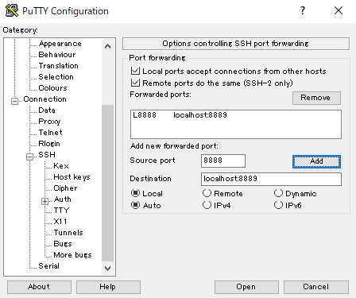

# Using Azure

For seminars with participants that have different personal computing setups, it can be useful to take advantage of cloud-based solutions in order to ensure everyone has access to the same hardware and software. Countless options exist, and while I have no particular preferences for any one service over another, in February 2018 I carried out a series of lectures using Microsoft's Azure service, in which 25+ participants were assigned their own instance of an Ubuntu-based *Data Science Virtual Machine* (DSVM). On this page, a few notes are recorded for posterity.

## Jupyter notebooks run remotely, viewed locally

Most of the information online regarding use of Jupyter notebooks on Azure seems to suggest using the X2Go Client to provide GUI access to the remote machine, within which Firefox (the default browser) can be used to view and edit Jupyter notebooks. This introduces some serious latency to each step in one's workflow. If all operations are going to be done via in-browser notebooks, then a better solution is to simply use SSH to log in to the remote machine, and using port forwarding, access the Jupyter server via a browser on the *local* machine.

Let's go through an example on Windows 10 (analogous procedures can be done with ssh from the shell of a UNIX-like system). To gain access to the remote shell, we use <a href="https://www.putty.org/">PuTTY</a>. When setting up the Azure DSVM (among other setups) there are two choices: (1) a password-based login, or (2) a SSH-based login. In the latter case, a public key of the proper format must be available on the local machine. The former requires just a user name and password at login. The latter requires in addition to this a public key on the local machine in the correct form. In any case, let's say we'll use port 8888 locally, and port 8889 remotely (these are typical, but arbitrary choices). The former is the source, and the latter is the destination. Setting up port forwarding in PuTTY:

With this setup, initiate the connection by giving PuTTY the remote machine's public IP address and the user name (and public key, if applicable), and log in, presenting the password when prompted.

Assuming a successful login, for our example we move to our desired working directory, and start up 
