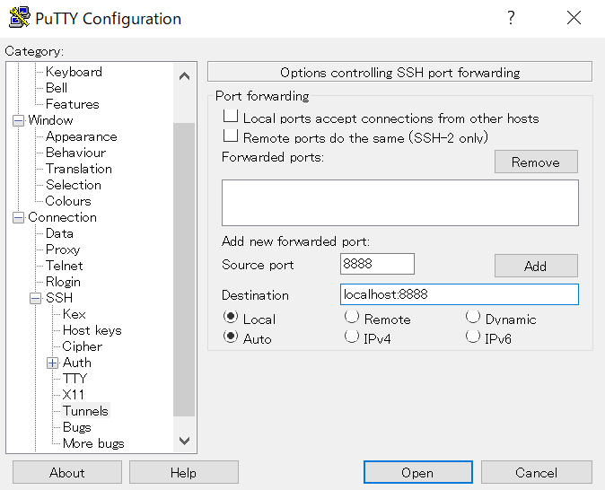

# Using cloud-based solutions

For seminars with participants that have different personal computing setups, it can be useful to take advantage of cloud services to ensure that everyone has access to the same system in terms of software (and effectively the same system in terms of hardware). I've used both of the following for running seminars with between 25-50 participants:

- Microsoft Azure, Ubuntu-based *Data Science Virtual Machine* (DSVM)

- Amazon Web Services (Elastic Compute Cloud, EC2), Ubuntu-based *Deep Learning AMI* (Amazon Machine Image)

Both worked very smoothly. I found the latter a fair bit faster, but either one works just fine. Here are a few notes for posterity that were useful for both MS and Amazon settings.


## Jupyter notebooks run remotely, viewed locally

Some people online suggest using the X2Go Client to provide GUI access to the remote machine, within which Firefox (the default browser) can be used to view and edit Jupyter notebooks. This introduces some serious latency to each step in one's workflow. If all operations are going to be done via in-browser notebooks, then a better solution is to simply use SSH to log in to the remote machine, and using port forwarding, access the Jupyter server via a browser on the *local* machine.

### Windows case

Let's go through an example on Windows 10 (analogous procedures can be done with ssh from the shell of a UNIX-like system). To gain access to the remote shell, we use <a href="https://www.putty.org/">PuTTY</a>. When setting up the instance, let's assume we set it to use an SSH-based login (this is usually the default), in which a private key is downloaded or generated, and must be stored on the local machine. All that remains is the "tunneling" setup. In any case, let's say we'll use port 8888 locally, and port 8888 remotely. The choice of port 8888 here on both ends is typical but arbitrary; also the source/destination port numbers need not match. Setting up port forwarding in PuTTY:



With this setup, initiate the connection by giving PuTTY the remote machine's public IP address and the user name (and public key, if applicable), and log in, presenting the password when prompted.

Assuming a successful login, for our example we move to our desired working directory, and start up Jupyter notebook without a browser, using the desired port:

```
$ cd learnml
$ jupyter notebook --no-browser --port=8888
```

After executing this command, a series of messages proceeds in the terminal window, culminating in the following:

```
The Jupyter Notebook is running at: http://localhost:8888/?token=XXXXXXXXXXX
```

where `XXXXXXXXXXX` is some sequence of alpha-numeric characters.

Now, since we have set up our port forwarding from 8888 (local) to 8888 (remote), in terms of local operations, all we need to do is open up our local browswer, and in the URL address bar enter

```
http://localhost:8888/?token=XXXXXXXXXXX
```

noting that everything in this URL is the same as in the remote terminal. If all has worked correctly, we should have access to the remote Jupyter notebooks, with the functional convenience of a local browser.


### Ubuntu case (16.04 LTS)

The UNIX-like case is even simpler than the Windows case. Here we use `ssh` from the command line to do SSH port-forwarding.

On the remote machine, once again, run

```
$ cd learnml
$ jupyter notebook --no-browser --port=8888
```

to get the notebook server going. Then on the local machine, start the tunnel:

```
$ ssh -N -L localhost:8888:localhost:8888 REMOTE_USER@REMOTE_HOST
```

where `REMOTE_USER` is replaced with your username, and `REMOTE_USER` is the name or IP address of the remote server. Then from the browser of your local machine, access `localhost:8888` using the URL including a token, exactly as shown in the previous example.


### Alternative to tokens: setting up a password-based notebook server

In the above examples, we considered the default case of using randomly-generated tokens to access the notebook server remotely. Doing the copying and pasting described above can be a bit of a nuisance, and indeed depending on your environment, copying from the remote desktop to the local one may require a bit of dexterity. This hassle can be easily circumvented by using a password set in advance for moderating access to the notebook server. To do this is simple. On the remote machine, run the following:

```
$ cd learnml
$ jupyter notebook password
> Enter password:
> Verify password:
```
It should then respond with `Wrote hashed password to ...` where the path to a particular `.json` file is specified.

With this password in place, in the above examples, instead of typing in the long URL+token string of text into the browser, one can simply enter `http://localhost:8888` and provide the password when prompted.
